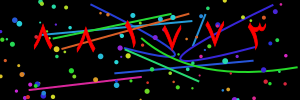
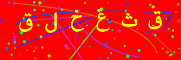
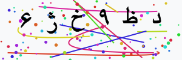

# Persian Captcha Generator
A lightweight library for generating customizable captchas with Persian numbers and alphabets. This library generates a captcha image with various options such as Persian numbers, alphabets, or both, and adds noise elements like random lines and dots for enhanced complexity.

<div align="center">
  <h2>Made with ❤ by <a href="https://github.com/alipiry">Ali Piry</a></h2>
</div>

## Features
- Generate captchas with:
  - Only Persian numbers
  - Only Persian alphabets
  - A mix of Persian numbers and alphabets
- Customizable:
  - Image size (width and height)
  - Font size and colors
  - Noise elements like lines and dots
- Outputs a PNG buffer and the text for verification

## Installation
`NPM`:
```bash
npm install persian-captcha-generator
```
`YARN`:
```bash
yarn add persian-captcha-generator
```


## Function API
The `persianCaptchaGenerator` function accepts the following options:
| Parameter       | Type                           | Default   | Description                                                                        |
|-----------------|--------------------------------|-----------|------------------------------------------------------------------------------------|
| `width`           | `number`                         | `200`       | Width of the captcha image (in pixels).                                            |
| `height`          | `number`                         | `80`        | Height of the captcha image (in pixels).                                           |
| `length`          | `number`                         | `5`         | Number of characters in the captcha text.                                          |
| `backgroundColor` | `string`                         | `"#ffffff"` | Background color of the captcha image (CSS color value).                           |
| `textColor`       | `string`                         | `"#000000"` | Text color of the captcha characters (CSS color value).                            |
| `fontSize`        | `string`                         | `32` | Font size of the captcha characters (in pixels).                                   |
| `lineCount`       | `string`                         | `5`         | Number of random lines drawn over the captcha for obfuscation.                     |
| `dotCount`        | `string`                         | `50`        | Number of random noise dots added to the captcha image.                            |
| `characterSet`    | `"numbers"`, `"alphabets"`, `"both"` | `numbers`   | Choose the type of characters in the captcha: Persian numbers, alphabets, or both. |


## Output
The `persianCaptchaGenerator` function returns an object with the following properties:
| Property | Type     | Description                                           |
|----------|----------|-------------------------------------------------------|
| `text`   | `string` | The randomly generated captcha text (for validation). |
| `buffer` | `Buffer` | The PNG image buffer of the generated captcha.        |

## Usage

```typescript
import fs from "fs";
import { persianCaptchaGenerator } from "persian-captcha-generator";

(async () => {
  const captcha = await persianCaptchaGenerator({
    length: 6,
    characterSet: "numbers",
    width: 300,
    height: 100,
    fontSize: 40,
    lineCount: 10,
    dotCount: 100,
    textColor: "#000000",
    backgroundColor: "#f8f9fa",
  });

  // Save the PNG buffer as a file
  fs.writeFileSync("captcha.png", captcha.buffer);

  // Log the captcha text for validation
  console.log("Generated Captcha Text:", captcha.text);
})();
```

## Sample images




